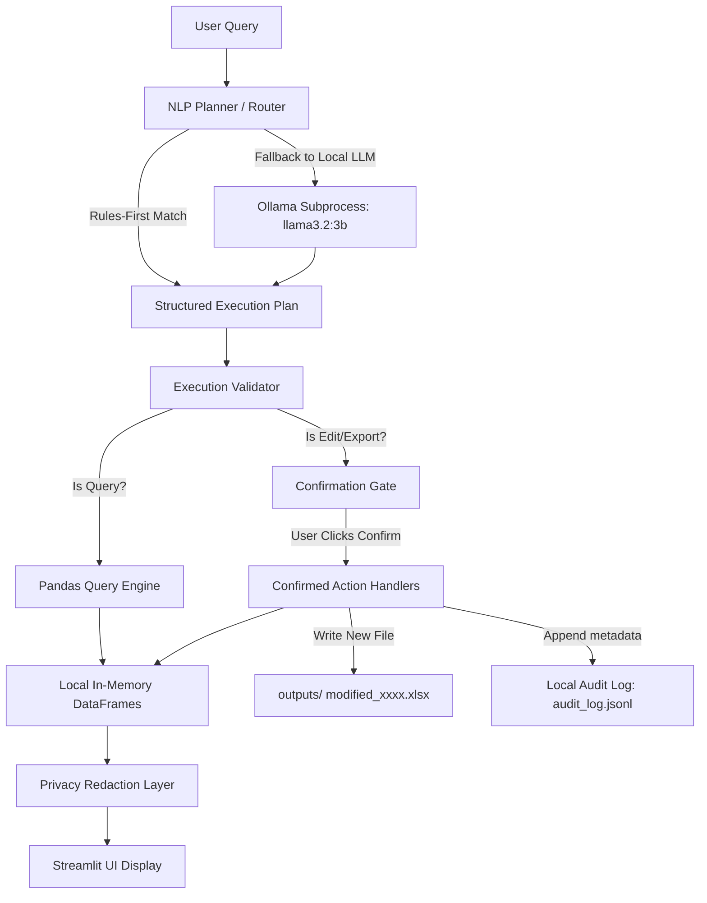

# Architecture Overview: Local-First Excel Assistant Pipeline

This document details the pipeline of the **Offline Dean-Office Student-Record Assistant**. Every operation is executed locally on the user's workstation. The system enforces a strict boundary between the natural language reasoning layer and the spreadsheet data layer to ensure student privacy.

---

## High-Level Execution Pipeline

---

## Key Pipeline Phases

### 1. Natural Language Parsing & Routing
When a user submits a query or clicks a suggested prompt chip:
1. **Rule-First Planner**: The system matches the query against regular expressions and semantic rules (such as identifying keywords like `advisor`, `gpa`, `students`, `department`, `department breakdown`, `those`).
2. **Local LLM Fallback (Optional)**: If the rule planner cannot resolve the query's intent, the request is passed to a locally running model instance (`llama3.2:3b`) managed via a dedicated subprocess port manager.
3. **Plan Formulation**: The outcome is a structured JSON plan detailing the target `sheet`, `filters`, `group_by`, `operation` (e.g. average, count), and `sort` parameters.

### 2. Execution Validation
Before pandas runs any plan:
1. The **Validator** checks the plan against the sheet's active schema.
2. It translates messy vocabulary (e.g. "department", "counselor") to canonical columns (`Discipline`, `Advisor`).
3. If columns are missing or sheets do not exist, a descriptive validation error is triggered immediately, stopping execution.

### 3. Local Spreadsheet Execution
* **Calculations**: Executed via standard Pandas query statements against the in-memory copies of the sheet DataFrames.
* **Original Workbook Protection**: The original file is opened in read-only mode. It is never modified by the application.
* **Temporary State**: Updates (such as setting an `Academic Watch` flag) are applied to copies of the DataFrames in Streamlit session memory.

### 4. Confirmation Gates & Writes
* **Confirmation Requirement**: Any write operation (such as adding a note or changing a status) requires explicit user confirmation.
* **Safe Writes**: Upon confirmation, the modified DataFrames are written to a brand-new, timestamped file in the `outputs/` directory.
* **Data Safety**: A notification is displayed in the Export Center, warning the user that the original uploaded workbook remains untouched.

### 5. Privacy Redaction Layer
* Before displaying query tables in the Streamlit UI, the privacy layer redacts sensitive columns (names, grades, disciplinary indicators) using structural placeholders.
* Only the final aggregated summary metric, descriptive text, and non-sensitive columns are shown by default.

### 6. Privacy-Safe Local Audit Logging
* Confirmed actions record execution metadata (timestamp, change type, rows affected, column names, filters) to `logs/audit_log.jsonl` (and/or local DB).
* **Zero Row Leakage**: No student names, grades, or comments are ever written to the audit log.
